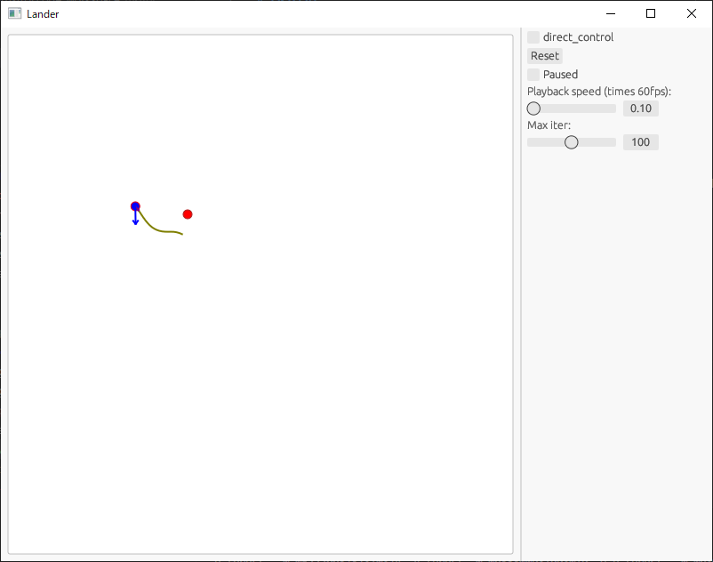

# rustrol

A control algorithm demonstration project with Rust

Try it now on your browser!

https://msakuta.github.io/rustrol/


## What is this?

This is a demonstration repository for control problems that is solved with [rustograd](https://github.com/msakuta/rustograd), an automatic differentiation library.
It has native GUI and WebAssembly version that can run on a browser.




This is the same problem as the Moon Lander game presented in [gym](https://www.gymlibrary.dev/content/basic_usage/) Python library for developing AI, only with a crappier graphics and a pure Rust implementation of autograd and solver.


## Control

Clicking on the canvas will start the lander vehicle from clicked position.

You can also try to maneuver the lander by yourself if you check `direct_control`.
You can use A and D keys to change orientation of the lander and press W to thrust upwards (relative to current lander's orientation).


## How to run natively

```
cargo r
```


## How to build a WebAssembly version

Install trunk by 

```
cargo install --locked trunk
```

and run

```
trunk build --release
```

