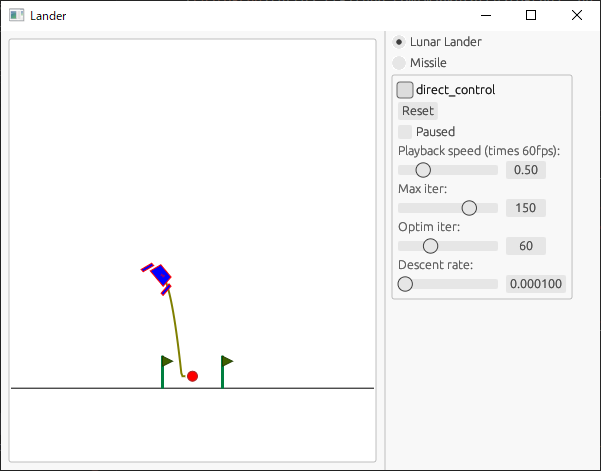

# rustrol

<p align="center">
    
</p>

A control algorithm demonstration project in Rust

Try it now on your browser!

https://msakuta.github.io/rustrol/


## What is this?

This is a demonstration repository for control problems that is solved with [rustograd](https://github.com/msakuta/rustograd), an automatic differentiation library.
It has native GUI and WebAssembly version that can run on a browser.



There are following models:

* Lunar Lander
* Missile
* Orbital Mechanics
* Three-body problem
* Kinematic Bicycle Model

### Lunar Lander


This is the same problem as the Lunar Lander game presented in [gym](https://www.gymlibrary.dev/content/basic_usage/) Python library for developing AI.
The gym is targetted for reinforcement learning, but actually we can do some decent job by just using the gradient descent on a cost function and its automatic differentiation.


### Missile

A homing missile maneuver with gravity and limited maneuverability.
It is a little bit more challenging because both the target and the missile are moving.
Also, there is a gravity pulling the missile down all the time.
However, it is very easy to define a loss function as the minimum distance between target and missile in every moment.


### Orbital Mechanics

An orbital rocket simulation.
The optimizer can adjust the initial velocity to rendezvous with the target object in another orbit.
It is a tricky problem since moving one way will not bring you to the desired direction at the destination.

* The target object is shown as a green circle.
* The blue line shows the initial trajectory of the satellite.
* The grey line shows the trajectory after the optimization.
* The purple line shows the trajectory of the target object.
* The circle with black border at the center shows the center of gravity, e.g. the Earth.


### Three-body problem

The three-body problem is a Neutonian dynamics problem to obtain the trajectory of celestial objects motions.
It is known to be very difficult to solve analytically.
In fact, the bigger problem is that it is very sensitive to the small difference to the initial conditions.

Automatic differentiation should be able to half-numerically solve and optimize the trajectory.
In this application, the satellite tries to maintain the orbital distane from the moon, while in the influence of gravity from both the Earth and the Moon.


Well, it is difficult even for automatic differentiation.


### Kinematic Bicycle Model

The [Kinematic Bicycle Model](https://dingyan89.medium.com/simple-understanding-of-kinematic-bicycle-model-81cac6420357) is commonly used to approximate the mechanical behavior of a 4-wheeled car.
The front wheel controls the steering, while the rear is fixed.
It is not trivial to plan a control strategy to follow an arbitrary path, because the problem is not holonomic.

We can use the loss as the distances of the path positions and the predicted states from the bicycle model and minimize it with automatic differentiation.

In the animation below:

* purple is the target path,
* a red circle and a red path is the subsection of the target path at the moment,
* a yellow line is the predicted states at the moment,
* and the green line is the actual trajectory followed.


## Control

Clicking on the canvas will start the lander vehicle from clicked position.

You can also try to maneuver the lander by yourself if you check `direct_control`.
You can use A and D keys to change orientation of the lander and press W to thrust upwards (relative to current lander's orientation).


## How to run natively

```
cargo r
```


## How to build a WebAssembly version

Install trunk by 

```
cargo install --locked trunk
```

and run

```
trunk build --release
```


## Train arc connector

The train tracks are calculated with a series of line segments and arcs.
It is a bit tricky to find the arc parameters to connect the line smoothly.
It is probably cryptic to understand it in [the source code](src/models/train.rs).
Compile and see [the LaTeX document](doc/circle.tex) for more detailed geometry.

```
$ pdflatex doc/circle.tex
```


## Where did this name come from?

I asked ChatGPT to come up with a name of Rust project to demonstrate control problem algorithms.
And it came up with this name.
